# Display Customer Locations Using a Fiori Map Control
<!-- description --> Further customize the generated app to display customer locations on a map and try out the features of the Fiori Map control, including the toolbar, map panel, clustering, and map annotation.

## Prerequisites
- You have [Set Up a BTP Account for Tutorials](group.btp-setup). Follow the instructions to get an account, and then to set up entitlements and service instances for the following BTP services.
    - **SAP Mobile Services**
- You completed [Try Out SAP BTP SDK Wizard for Android](cp-sdk-android-wizard-app).


## You will learn
  - How to add a Google Map to the wizard-generated app and display customer locations
  - How to add a Fiori Map control and try out its features

## Intro
A Fiori Map control extends the Google [Maps SDK for Android](https://developers.google.com/maps/documentation/android-sdk/intro) or `Esri` [`ArcGIS Runtime SDK for Android`](https://developers.arcgis.com/android/). It provides additional APIs that handle clustering, as well as a toolbar, panel, and an editor to annotate map. For additional details, see [Fiori Design Guidelines](https://experience.sap.com/fiori-design-android/).

---

### Create a new screen to display a map


In this section you will create a new activity to display a map.

1.  In Android Studio, in the project explorer, navigate to **`app > java > com.sap.wizapp > mdui > customers`**.

2.  Right-click and choose **`New > Activity > Gallery... > Google Maps Activity`**.

    <!-- border -->

3.  Set **Activity Name** to be **`CustomersMapActivity`**.

    <!-- border -->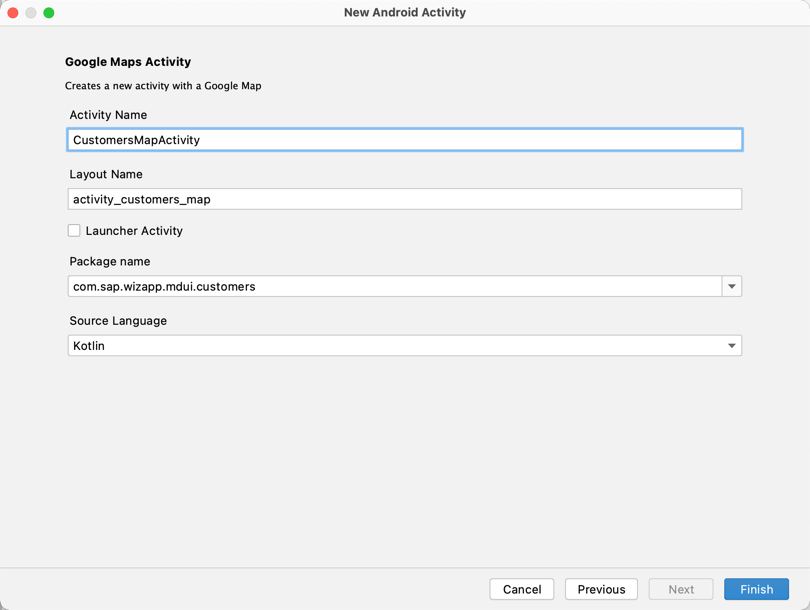

4.  Click **Finish**.

5.  In the `AndroidManifest.xml` file, copy the URL on line 18.

6.  Paste the URL into a browser to register the application with the Maps SDK for Android. Follow the instructions to get an **API Key**.

7.  Open the `local.properties` file in your project-level directory and then add the following code. Replace `YOUR_API_KEY` with your API key.

    ```
    MAPS_API_KEY=YOUR_API_KEY
    ```

8.  In your `AndroidManifest.xml` file, go to `com.google.android.geo.API_KEY` and update the `android:value` attribute as follows:

    ```XML
    <meta-data
      android:name="com.google.android.geo.API_KEY"
      android:value="${MAPS_API_KEY}" />
    ```

9.  In the same file just below the `com.google.android.geo.API_KEY`, change the name of activity from `.CustomersMapActivity` to **`.mdui.customers.CustomersMapActivity`**.

10.  On Windows, press **`Ctrl+N`**, or, on a Mac, press **`command+O`**, and type **`EntitySetListActivity`** to open `EntitySetListActivity.kt`.

11.  On Windows, press **`Ctrl+F`**, or, on a Mac press **`command+F`**, and search for **`CustomersActivity::class`**.

12.  Replace `CustomersActivity::class` with **`CustomersMapActivity::class`** so that when the user taps on **Customers**, the app will navigate to the newly added activity that includes a map.

13.  On Windows press **`Ctrl+N`** or on a Mac press **`command+O`**, and type **`CustomersMapActivity`** to open `CustomersMapActivity.kt`.

14. Add the following import if it isn't added automatically:

    ```Kotlin
    import com.sap.wizapp.R
    ```

15.  Find the following import:

    ```Kotlin
    import com.sap.wizapp.mdui.customers.databinding.ActivityCustomersMapBinding
    ```

16.  Change it to the following import if it isn't changed automatically:

    ```Kotlin
    import com.sap.wizapp.databinding.ActivityCustomersMapBinding
    ```

17.  Run the app. Select **Customers**.

    <!-- border -->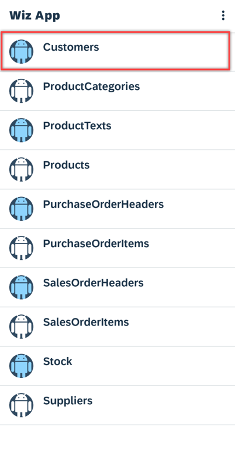

    Instead of a customer list, a map is now displayed.

    <!-- border -->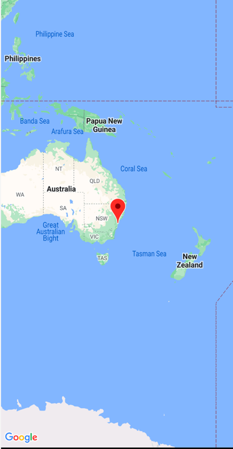

    >If a message appears that says **Wiz App** is having trouble with **Google Play services**, try running the app on an Android emulator that includes the **Google Play Store** app.


### Populate the map with customer locations


In this section, you will add code to place a marker on the map for each customer.

1.  On Windows, press **`Ctrl+N`**, or, on a Mac, press **`command+O`**, and type **`CustomersMapActivity`** to open `CustomersMapActivity.kt`.

2.  Add the following class variable:

    ```Kotlin
    private val locations = HashMap<String, LatLng>()
    ```

3.  Add the following methods:

    ```Kotlin
    private fun addCustomersToMap() {
        val query = DataQuery()
                .from(ESPMContainerMetadata.EntitySets.customers)
                .where(Customer.country.equal("US")
                        .or(Customer.country.equal("CA"))
                        .or(Customer.country.equal("MX")))
        val sapServiceManager = (application as SAPWizardApplication).sapServiceManager
        val eSPMContainer = sapServiceManager?.eSPMContainer
        eSPMContainer?.let {
            it.getCustomersAsync(query, { customers: List<Customer> ->
                for (customer in customers) {
                    Log.d("", "Adding a marker for " + customer.city)
                    addCustomerMarkerToMap(customer)
                }
            }, { re: RuntimeException -> Log.d("", "An error occurred during async query: " + re.message) })
        }
    }

    private fun getCustomerLatLongFromAddress(address: String): LatLng? {
        locations[address]?.let {
            return it
        }

        //String strAddress = "Wilmington, Delaware, US";
        val coder = Geocoder(this)
        try
        {   // May throw an IOException
            val addresses = coder.getFromLocationName(address, 5)
            if (addresses.isNullOrEmpty())
            {
                return null
            }
            val location = addresses[0]
            return LatLng(location.latitude, location.longitude)
        }
        catch (ex: IOException) {
            ex.printStackTrace()
            return null
        }
    }

    private fun addCustomerMarkerToMap(customer: Customer) {
        val latLng = getCustomerLatLongFromAddress(customer.city + ", " + customer.country)
        latLng?.let {
            val customerMarker = mMap.addMarker(MarkerOptions()
                    //.snippet("")
                    .position(it)
                    .title(customer.firstName + " " + customer.lastName)
            )
            customerMarker?.tag = customer
        }
    }
    ```

4.  On Windows, press **`Ctrl+F12`**, or, on a Mac, press **`command+F12`**, and type **`onMapReady`** to move to the `onMapReady` method.

5.  Replace it with the following code:

    ```Kotlin
    override fun onMapReady(googleMap: GoogleMap) {
        mMap = googleMap
        val centre = LatLng(39.8283, -98.5795)
        mMap.moveCamera(CameraUpdateFactory.newLatLng(centre))

        // For demo purposes, speed up the lookup of address details.
        // Will use Geocoder to translate an address to a LatLng if address is not in this list
        locations.put("Wilmington, Delaware, US", LatLng(39.744655, -75.5483909))
        locations.put("Antioch, Illinois, US", LatLng(42.4772418, -88.0956396))
        locations.put("Santa Clara, California, US", LatLng(37.354107899999995, -121.9552356))
        locations.put("Hermosillo, MX", LatLng(29.0729673, -110.9559192))
        locations.put("Bismarck, North Dakota, US", LatLng(46.808326799999996, -100.7837392))
        locations.put("Ottawa, CA", LatLng(45.4215296, -75.69719309999999))
        locations.put("México, MX", LatLng(23.634501, -102.55278399999999))
        locations.put("Boca Raton, Florida, US", LatLng(26.368306399999998, -80.1289321))
        locations.put("Carrollton, Texas, US", LatLng(32.9756415, -96.8899636))
        locations.put("Lombard, Illinois, US", LatLng(41.8800296, -88.00784349999999))
        locations.put("Moorestown, US", LatLng(39.9688817, -74.948886))
        addCustomersToMap()
    }
    ```

6.  Run the app.

7.  Select **Customers** and notice that a map is displayed that contains a marker for every customer.

    <!-- border -->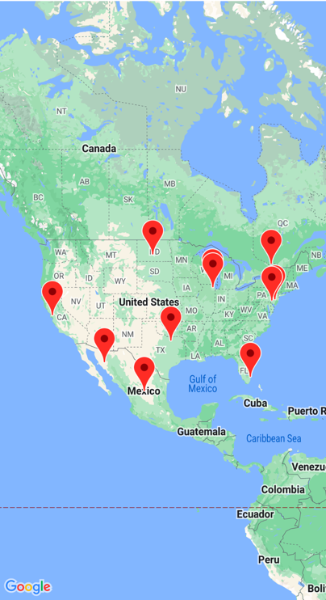

    If a marker is tapped, an info marker is displayed with additional customer details.

    <!-- border -->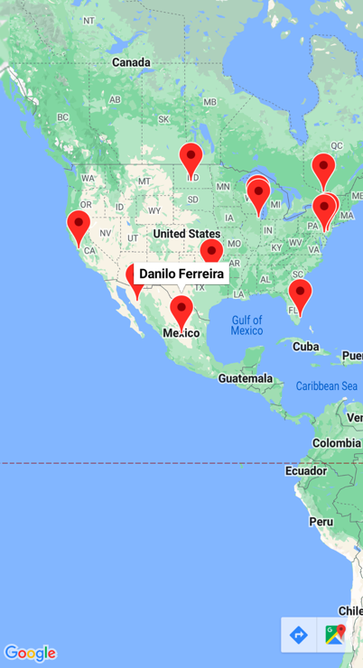


### Implement navigation to the customer details screen


In this section, you will add code to display the customer detail screen when the info marker is tapped.

1.  In the class definition for `CustomersMapActivity`, after `OnMapReadyCallback`, add:

    ```Kotlin
    , GoogleMap.OnInfoWindowClickListener
    ```

2.  Add the following method to the class:

    ```Kotlin
    override fun onInfoWindowClick(marker: Marker) {//import com.google.android.gms.maps.model.Marker
        val customer = marker.tag as Customer
        val intent = Intent(this, CustomersActivity::class.java)
        intent.putExtra(BundleKeys.ENTITY_INSTANCE, customer)
        startActivity(intent)
    }
    ```

3.  In the `onMapReady` method in `CustomersMapActivity`, add the following line to the end of the method:

    ```Kotlin
    mMap.setOnInfoWindowClickListener(this)
    ```

4.  On Windows, press **`Ctrl+N`**, or, on a Mac, press **`command+O`**, and type **`CustomersActivity`** to open `CustomersActivity.kt`.

5.  On Windows, press **`Ctrl+F12`**, or, on a Mac, press **`command+F12`**, and type **`onCreate`** to navigate to the `onCreate` method.

6.  Replace the `if (savedInstanceState == null)` block (keep `else-block` unchanged) in the `onCreate` method with the following code:

    ```Kotlin
    if (savedInstanceState == null) {
        val listFragment = CustomersListFragment()
        intent.extras?.let {
            if (it.containsKey(BundleKeys.ENTITY_INSTANCE)) {
                listFragment.arguments = it
            }
        }
        supportFragmentManager.beginTransaction()
                .replace(R.id.masterFrame, listFragment, UIConstants.LIST_FRAGMENT_TAG)
                .commit()
    }
    ```

7.  On Windows, press **`Ctrl+N`**, or, on a Mac, press **`command+O`**, and type **`CustomersListFragment`** to open `CustomersListFragment.kt`.

8.  Add the following variable to the top of the class:

    ```Kotlin
    private var entityFromMap: Customer? = null
    ```

9.  On Windows, press **`Ctrl+F12`**, or, on a Mac, press **`command+F12`**, and type **`onCreate`** to navigate to the `onCreate` method.

10.  Add the following code to the end of the method:

    ```Kotlin
    arguments?.let {
        if (it.containsKey(BundleKeys.ENTITY_INSTANCE)) {
            entityFromMap = it.get(BundleKeys.ENTITY_INSTANCE) as Customer
        }
    }
    ```

11.  On Windows, press **`Ctrl+F12`**, or, on a Mac, press **`command+F12`**, and type **`onViewStateRestored`** to navigate to the `onViewStateRestored` method.

12.  Add the following code to the end of the method:

    ```Kotlin
    entityFromMap?.let {
        viewModel.setSelectedEntity(it)
        listener?.onFragmentStateChange(UIConstants.EVENT_ITEM_CLICKED, it)
        entityFromMap = null
    }
    ```

13.  Run the app. Select **Customers**, and tap on a marker. Then tap on the info marker.

    <!-- border -->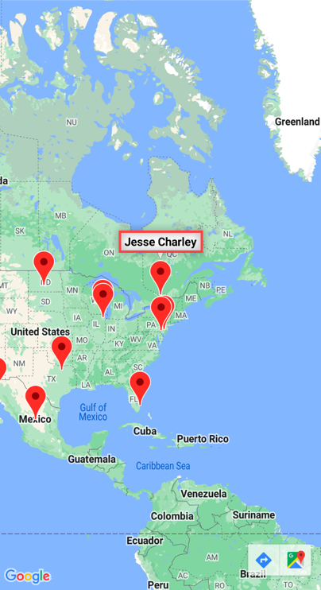

    This sequence displays the customer details page.

    <!-- border -->


### Enhance the app to use the Fiori Map control


In this section, you will create a new activity that uses the Fiori Map control.

1.  Press **`Shift`** twice, and type **`styles.xml`** to open `styles.xml`.

2.  Add the following code right after `AppTheme` and before `AppTheme.NoActionBar`:

    ```XML
    <style name="FioriMap.NoActionBar" parent="FioriTheme">
        <item name="windowActionBar">false</item>
        <item name="windowNoTitle">true</item>
        <item name="windowActionModeOverlay">true</item>
    </style>
    ```

3.  Add the following dependency in the app module's `build.gradle` file in the dependencies object.

    ```Gradle
    implementation group: 'com.sap.cloud.android', name: 'google-maps', version: sdkVersion
    ```

    <!-- border -->

4.  Create a new **Layout Resource File** in `res/layout` called **`detail_panel.xml`** and replace its contents with the following code.

    <!-- border -->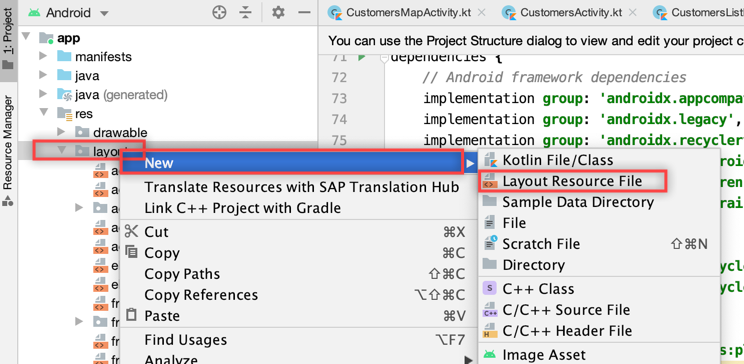

    ```XML
    <?xml version="1.0" encoding="utf-8"?>
    <androidx.constraintlayout.widget.ConstraintLayout xmlns:android="http://schemas.android.com/apk/res/android"
        xmlns:tools="http://schemas.android.com/tools"
        android:layout_width="match_parent"
        android:layout_height="match_parent"
        tools:layout_constraintVertical_weight="100">

        <TextView
            android:layout_width="match_parent"
            android:layout_height="match_parent"
            android:paddingTop="4dp"
            android:paddingLeft="4dp"
            android:text="Default panel content goes here" />

    </androidx.constraintlayout.widget.ConstraintLayout>
    ```

5.  Create a new **Layout Resource File** in `res/layout` called **`search_auto_complete.xml`** and replace its contents with the following code.

    ```XML
    <?xml version="1.0" encoding="utf-8"?>
    <LinearLayout xmlns:android="http://schemas.android.com/apk/res/android"
        xmlns:app="http://schemas.android.com/apk/res-auto"
        android:layout_width="match_parent"
        android:layout_height="match_parent">
        <androidx.appcompat.widget.AppCompatTextView
            android:id="@+id/search_auto_complete_text"
            android:layout_width="match_parent"
            android:layout_height="50dp" />

    </LinearLayout>
    ```

6.  In Android Studio, using the project explorer, navigate to **`app > java > com.sap.wizapp > mdui > customers`**.

7.  Right-click and choose **New** > **Activity** > **Empty Activity**.

8.  Set **Activity Name** to be **`CustomersFioriMapActivity`**.

9.  Click **Finish**.

    <!-- border -->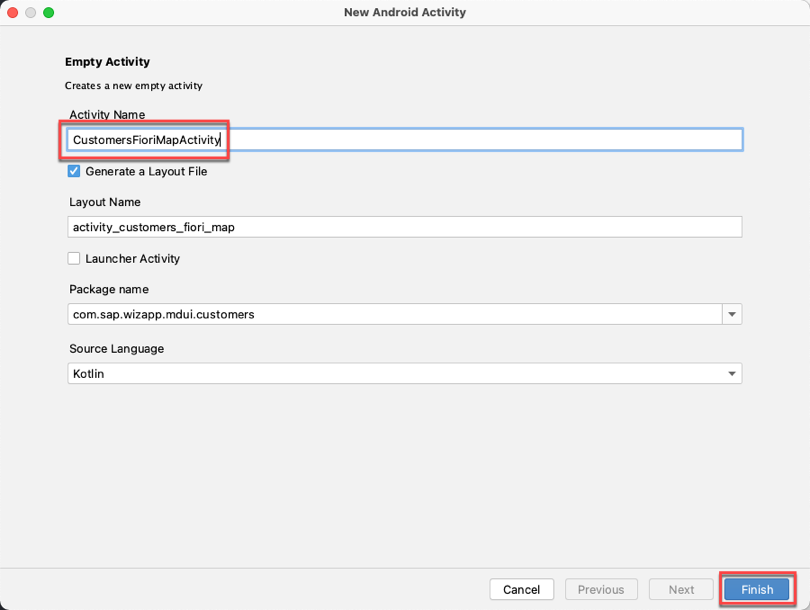

10.  Replace the file contents in the newly created `CustomersFioriMapActivity.kt` with the following code:

    ```Kotlin
    package com.sap.wizapp.mdui.customers

    import android.app.SearchManager
    import android.content.Context
    import android.content.Intent
    import android.location.Geocoder
    import android.os.Bundle
    import android.util.Log
    import android.view.LayoutInflater
    import android.view.View
    import android.view.inputmethod.InputMethodManager
    import android.widget.ArrayAdapter
    import android.widget.ImageButton

    import com.google.android.gms.maps.CameraUpdateFactory
    import com.google.android.gms.maps.GoogleMap
    import com.google.android.gms.maps.model.LatLng
    import com.sap.cloud.android.odata.espmcontainer.Customer
    import com.sap.cloud.android.odata.espmcontainer.ESPMContainerMetadata
    import com.sap.cloud.mobile.fiori.maps.google.GoogleFioriMapView
    import com.sap.cloud.mobile.fiori.maps.google.GoogleMapActionProvider
    import com.sap.cloud.mobile.fiori.maps.google.GoogleMapViewModel
    import com.sap.cloud.mobile.odata.DataQuery
    import com.sap.wizapp.R
    import com.sap.wizapp.app.SAPWizardApplication
    import com.sap.wizapp.mdui.BundleKeys

    import androidx.appcompat.app.AppCompatActivity
    import com.sap.cloud.mobile.fiori.maps.*
    import java.io.IOException

    class CustomersFioriMapActivity : AppCompatActivity(), GoogleFioriMapView.OnMapCreatedListener {
        private lateinit var mGoogleFioriMapView: GoogleFioriMapView
        private var mUseClustering = false
        private var mMapType: Int = 0
        private val locations = HashMap<String, LatLng>() // Used for demo purposes to speed up the process of converting an address to lat, long
        private val markers = HashMap<String, FioriMarkerOptions>() // Used to associate an address with a marker for search
        private val addresses = arrayListOf<String>() // Used to populate the list of addresses that are searchable
        private lateinit var mActionProvider: GoogleMapActionProvider

        override fun onCreate(savedInstanceState: Bundle?) {
            super.onCreate(savedInstanceState)

            val intent = intent
            setContentView(R.layout.activity_customers_fiori_map)

            mGoogleFioriMapView = findViewById(R.id.googleFioriMap)
            mGoogleFioriMapView.onCreate(savedInstanceState)

            savedInstanceState?.let {
                mUseClustering = it.getBoolean("UseClustering", false)
                mMapType = it.getInt("MapType", GoogleMap.MAP_TYPE_NORMAL)
            }
            mGoogleFioriMapView.setOnMapCreatedListener(this)
        }

        /**
         * Manipulates the map once available.
         * This callback is triggered when the map is ready to be used.
         * This is where we can add markers or lines, add listeners or move the camera. In this case,
         * we just add a marker near Toronto, Canada.
         */
        override fun onMapCreated() {
            mActionProvider = GoogleMapActionProvider(mGoogleFioriMapView, this)
            // For demo purposes, speed up the lookup of address details.
            // Will use Geocoder to translate an address to a LatLng if address is not in this list
            locations.put("Wilmington, Delaware, US", LatLng(39.744655, -75.5483909))
            locations.put("Antioch, Illinois, US", LatLng(42.4772418, -88.0956396))
            locations.put("Santa Clara, California, US", LatLng(37.354107899999995, -121.9552356))
            locations.put("Hermosillo, MX", LatLng(29.0729673, -110.9559192))
            locations.put("Bismarck, North Dakota, US", LatLng(46.808326799999996, -100.7837392))
            locations.put("Ottawa, CA", LatLng(45.4215296, -75.69719309999999))
            locations.put("México, MX", LatLng(23.634501, -102.55278399999999))
            locations.put("Boca Raton, Florida, US", LatLng(26.368306399999998, -80.1289321))
            locations.put("Carrollton, Texas, US", LatLng(32.9756415, -96.8899636))
            locations.put("Lombard, Illinois, US", LatLng(41.8800296, -88.00784349999999))
            locations.put("Moorestown, US", LatLng(39.9688817, -74.948886))
            addCustomersToMap()

            // Setup toolbar buttons and add to the view.
            val settingsButton = SettingsButton(mGoogleFioriMapView.toolbar.context)
            val legendButton = LegendButton(mGoogleFioriMapView.toolbar.context)
            legendButton.isEnabled = true
            val locationButton = LocationButton(mGoogleFioriMapView.toolbar.context)
            val extentButton = ZoomExtentButton(mGoogleFioriMapView.toolbar.context)
            val buttons = arrayOf<ImageButton>(settingsButton, legendButton, locationButton, extentButton)
            mGoogleFioriMapView.toolbar.addButtons(buttons.asList())

            // Setup draggable bottom panel
            val inflater = getSystemService(Context.LAYOUT_INFLATER_SERVICE) as LayoutInflater
            val detailView = inflater.inflate(R.layout.detail_panel, null)
            mGoogleFioriMapView.setDefaultPanelContent(detailView)

            mActionProvider.setClustering(false)

            val currentPosition = (mActionProvider.mapViewModel as GoogleMapViewModel).latLng
            val currentZoom = (mActionProvider.mapViewModel as GoogleMapViewModel).zoom
            if (currentPosition != null && currentZoom != 0f)
            {
                // Position the camera after a lifecycle event.
                mGoogleFioriMapView.map?.moveCamera(CameraUpdateFactory.newLatLngZoom(currentPosition, currentZoom))
            }
            else
            {
                // Move the camera to the centre of North America
                val centre = LatLng(39.8283, -98.5795)
                mGoogleFioriMapView.map?.animateCamera(CameraUpdateFactory.newLatLng(centre))
            }

            findViewById<FioriMapSearchView>(R.id.fiori_map_search_view)?.let {
                val searchManager = getSystemService(Context.SEARCH_SERVICE) as SearchManager
                it.setSearchableInfo(searchManager.getSearchableInfo(componentName))
                it.setAdapter(ArrayAdapter<String>(this@CustomersFioriMapActivity, R.layout.search_auto_complete, R.id.search_auto_complete_text, addresses))
                it.setThreshold(2)
                it.setOnItemClickListener{ parent, view, position, id ->
                    it.setQuery(parent.getItemAtPosition(position).toString(), false)
                    searchResultSelected(parent.getItemAtPosition(position) as String)
                    val inputMethodManager = getSystemService(INPUT_METHOD_SERVICE) as InputMethodManager
                    inputMethodManager.hideSoftInputFromWindow(it.windowToken, 0) }
            }
        }

        private fun searchResultSelected(selectedSearchResult: String) {
            locations[selectedSearchResult]?.let { latLng ->
                // Center the marker.
                mGoogleFioriMapView.map?.moveCamera(CameraUpdateFactory.newLatLng(latLng))
                // Select the marker (or cluster the marker is in).
                mActionProvider.selectMarker(markers[selectedSearchResult])
            }
        }

        // Methods overriding the lifecycle events are required for FioriMapView to run properly
        override fun onStart() {
            super.onStart()
            mGoogleFioriMapView.onStart()
        }

        override fun onResume() {
            super.onResume()
            mGoogleFioriMapView.onResume()
        }

        override fun onPause() {
            super.onPause()
            mGoogleFioriMapView.onPause()
        }

        override fun onStop() {
            super.onStop()
            mGoogleFioriMapView.onStop()
        }

        override fun onDestroy() {
            super.onDestroy()
            mGoogleFioriMapView.onDestroy()
        }

        override fun onSaveInstanceState(bundle: Bundle) {
            super.onSaveInstanceState(bundle)
            mGoogleFioriMapView.onSaveInstanceState(bundle)

            bundle.putBoolean("UseClustering", mUseClustering)
            bundle.putInt("MapType", mMapType)
        }

        override fun onLowMemory() {
            super.onLowMemory()
            mGoogleFioriMapView.onLowMemory()
        }

        private fun getCustomerLatLongFromAddress(address: String) : LatLng? {
            locations[address]?.let {
                return it
            }

            // String strAddress = "Wilmington, Delaware";
            val coder = Geocoder(this)
            try
            {   // May throw an IOException
                val addresses = coder.getFromLocationName(address, 5)
                if (addresses.isNullOrEmpty())
                {
                    return null
                }

                val location = addresses[0]
                return LatLng(location.latitude, location.longitude)
            }
            catch (ex: IOException) {
                ex.printStackTrace()
                return null
            }
        }

        private fun addCustomerMarkerToMap(customer: Customer) {
            getCustomerLatLongFromAddress(customer.city + ", " + customer.country)?.let {latLng ->
                val customerMarker = FioriMarkerOptions.Builder()
                        .tag(customer)
                        .point(FioriPoint(latLng.latitude, latLng.longitude))
                        .title(customer.firstName + " " + customer.lastName)
                        .legendTitle("Customer")
                        .build()
                mActionProvider.addMarker(customerMarker)
                markers.put(customer.city + ", " + customer.country, customerMarker)
                mGoogleFioriMapView.map?.moveCamera(CameraUpdateFactory.newLatLng(latLng))
            }
        }

        private fun addCustomersToMap() {
            val query = DataQuery()
                    .from(ESPMContainerMetadata.EntitySets.customers)
                    .where(Customer.country.equal("US")
                            .or(Customer.country.equal("CA"))
                            .or(Customer.country.equal("MX")))
            val sapServiceManager = (application as SAPWizardApplication).sapServiceManager
            val eSPMContainer = sapServiceManager?.eSPMContainer
            eSPMContainer?.let {
                it.getCustomersAsync(query, { customers: List<Customer> ->
                    for (customer in customers)
                    {
                        addCustomerMarkerToMap(customer)
                        addresses.add(customer.city + ", " + customer.country)
                    }
                    mActionProvider.doExtentsAction() }, { re: RuntimeException -> Log.d("", "An error occurred during async query: " + re.message) })
            }
        }
    }
    ```

11.  Press **Shift** twice and type **`activity_customers_fiori_map.xml`** to open `activity_customers_fiori_map.xml`.

12.  Replace its contents with the following code.

    ```XML
    <?xml version="1.0" encoding="utf-8"?>
    <androidx.constraintlayout.widget.ConstraintLayout xmlns:android="http://schemas.android.com/apk/res/android"
        xmlns:app="http://schemas.android.com/apk/res-auto"
        xmlns:tools="http://schemas.android.com/tools"
        android:layout_width="match_parent"
        android:layout_height="match_parent"
        tools:context=".mdui.customers.CustomersFioriMapActivity">

        <com.sap.cloud.mobile.fiori.maps.google.GoogleFioriMapView
            android:id="@+id/googleFioriMap"
            android:layout_width="match_parent"
            android:layout_height="match_parent"
            />

    </androidx.constraintlayout.widget.ConstraintLayout>
    ```

13.  On Windows, press **`Ctrl+N`**, or, on a Mac, press **`command+O`**, and type **`EntitySetListActivity`** to open `EntitySetListActivity.kt`.

14.  On Windows, press **`Ctrl+F`**, or, on a Mac, press **`command+F`**, and search for **`CustomersMapActivity::class`**.

15.  Replace `CustomersMapActivity::class` with **`CustomersFioriMapActivity::class`** so that when the user taps on **Customers**, the app will navigate to the newly added activity with the Fiori map on it.

16.  On Windows, press **`Ctrl+Shift+N`**, or, on a Mac, press **`command+Shift+O`**, and type **`AndroidManifest`** to open `AndroidManifest.xml`.

17.  On Windows, press **`Ctrl+F`**, or, on a Mac, press **`command+F`**, and search for **`CustomersFioriMapActivity`**.

18.  Modify the activity so it specifies the `NoActionBar` theme, which will cause the activity to not display an action bar.

    ```XML
    <activity
        android:name=".mdui.customers.CustomersFioriMapActivity"
        android:theme="@style/FioriMap.NoActionBar"
        android:exported="false" />
    ```

19.  Run the app.

    You should be able to see markers on the screen that represent customers.

    <!-- border -->

    Users can use the search bar at the top of the screen to find markers. For example, enter **`Illinois`** or **`MX`**.

    <!-- border -->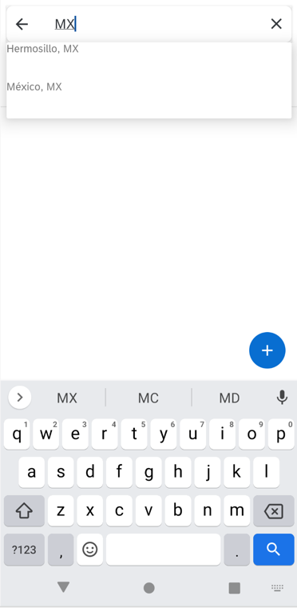

    The toolbar on the side provides icons for a settings dialog, marker legend, current location, and zoom to the extent of the markers on the map.

    <!-- border -->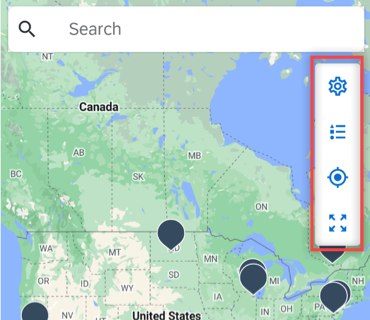

    The floating action button in the bottom right corner opens the edit annotations panel, which provides the capability to draw points, lines, and polygons on the map.

    The bottom panel is where additional details for a selected marker can be displayed.


### Implement the map panel


In this section, the bottom panel will be populated with details of the selected marker and an action will be implemented to enable navigation to the selected customer's detail page.

1.  On Windows, press **`Ctrl+N`**, or, on a Mac, press **`command+O`**, and type **`CustomersFioriMapActivity`** to open `CustomersFioriMapActivity.kt`.

2.  At the top of the class, add the following variables:

    ```Kotlin
    private lateinit var mMapResultsAdapter: MapResultsAdapter
    ```

3.  At the bottom of the class, add the following methods and the `MapResultsAdapter` class.

    ```Kotlin
    private fun setupInfoProvider() {
        val infoAdapter = object:AnnotationInfoAdapter {
            override fun getInfo(tag: Any) : Any {
                return tag
            }

            override fun onBindView(mapPreviewPanel: MapPreviewPanel, info: Any) {
                val customer = info as Customer
                mapPreviewPanel.setTitle(customer.firstName + " " + customer.lastName)

                val objectHeader = mapPreviewPanel.objectHeader
                objectHeader.apply {
                    headline = customer.city + ", " + customer.country
                    val customerLatLng = getCustomerLatLongFromAddress(customer.city + ", " + customer.country)
                    customerLatLng?.let {
                        body = "Latitude: " + it.latitude
                        footnote = "Longitude " + it.longitude
                    }
                }

                val cell = ActionCell(this@CustomersFioriMapActivity)
                cell.apply {
                    setText(customer.phoneNumber)
                    setIcon(R.drawable.ic_phone_black_24dp)
                }

                val cell2 = ActionCell(this@CustomersFioriMapActivity)
                cell2.apply {
                    setText(customer.emailAddress)
                    setIcon(R.drawable.ic_email_black_24dp)
                }

                val cell3 = ActionCell(this@CustomersFioriMapActivity)
                cell3.apply {
                    setText(customer.houseNumber + " " + customer.street)
                    setIcon(R.drawable.ic_map_marker_unselected)
                }

                val cell4 = ActionCell(this@CustomersFioriMapActivity)
                cell4.apply {
                    setText("Additional Details")
                    setIcon(R.drawable.ic_list_24dp)
                    setOnClickListener{ v ->
                        val intent = Intent(this@CustomersFioriMapActivity, CustomersActivity::class.java)
                        intent.putExtra(BundleKeys.ENTITY_INSTANCE, customer)
                        startActivity(intent) }
                }

                mapPreviewPanel.setActionCells(cell, cell2, cell3, cell4)
            }
        }
        mActionProvider.annotationInfoAdapter = infoAdapter
    }

    private fun setListAdapter() {
            val mMapListPanel = mGoogleFioriMapView.mapListPanel
            mMapResultsAdapter = MapResultsAdapter()
            mMapListPanel.setAdapter(mMapResultsAdapter)
    }

    class ViewHolder(itemView: View): RecyclerView.ViewHolder(itemView) {
        lateinit var objectCell: ObjectCell
        init{
            if (itemView is ObjectCell) {
                objectCell = itemView
            }
        }
    }

    inner class MapResultsAdapter: RecyclerView.Adapter<ViewHolder>(), MapListPanel.MapListAdapter {
        val customers = arrayListOf<Customer>()

        override fun onCreateViewHolder(parent: ViewGroup, viewType: Int) : ViewHolder {
            val cell = ObjectCell(parent.context)
            cell.preserveIconStackSpacing = true
            cell.preserveDetailImageSpacing = false
            return ViewHolder(cell)
        }

        override fun onBindViewHolder(holder: ViewHolder, position: Int) {
            val customer = customers[position]
            val resultCell = holder.objectCell
            resultCell.apply {
                headline = customer.firstName + " " + customer.lastName
                subheadline = customer.houseNumber + " " + customer.street + ", " + customer.city
                setStatus(customer.country, 1)
                setOnClickListener{ v->
                    val intent = Intent(this@CustomersFioriMapActivity, CustomersActivity::class.java)
                    intent.putExtra(BundleKeys.ENTITY_INSTANCE, customer)
                    startActivity(intent) }
            }
        }

        override fun getItemCount(): Int {
            return customers.size
        }

        override fun clusterSelected(list: List<FioriMarkerOptions>?) {
            customers.clear()
            list?.let { l ->
                for (fmo in l) {
                    fmo.tag?.let {
                        customers.add(it as Customer)
                    }
                }
            }
        }
    }

    ```

4.  On Windows, press **`Ctrl+F12`**, or, on a Mac, press **`command+F12`**, and search for **`onMapCreated`**.

5.  At the top of the method, below the line that sets `mActionProvider`, add the following code:

    ```Kotlin
    setupInfoProvider()
    setListAdapter()
    ```

6.  In the same method, comment out the following code. This will disable the default content panel so that the panel can be populated by the new methods.

    ```Kotlin
    val detailView = inflater.inflate(R.layout.detail_panel, null)
    mGoogleFioriMapView.setDefaultPanelContent(detailView)
    ```

7.  Run the app.

    Now, when you tap on a marker, the bottom panel should be populated with customer data.

    <!-- border -->

8.  Tap on **Additional Details**.

    <!-- border -->

    Notice that the customer details screen is now displayed.

    <!-- border -->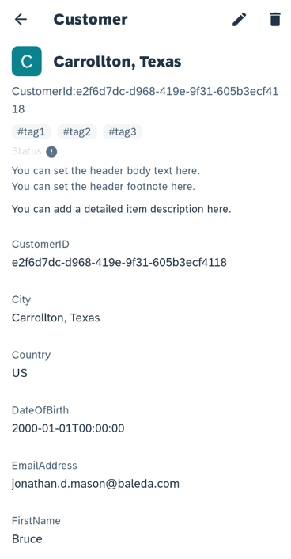


### Implement settings


In this section you will implement the settings dialog to include a map type setting and a clustering toggle.

1.  Create a new **Layout Resource File** in `res/layout` called **`settings_panel.xml`** and replace its contents with the following code. This creates the layout for the settings page.

    ```XML
    <?xml version="1.0" encoding="utf-8"?>
    <ScrollView xmlns:android="http://schemas.android.com/apk/res/android"
        xmlns:app="http://schemas.android.com/apk/res-auto"
        android:layout_width="match_parent"
        android:layout_height="match_parent">

        <LinearLayout
            android:layout_width="match_parent"
            android:layout_height="wrap_content"
            android:orientation="vertical">

            <LinearLayout
                android:layout_width="match_parent"
                android:layout_height="wrap_content"
                android:layout_gravity="fill_horizontal"
                android:orientation="horizontal">

                <com.sap.cloud.mobile.fiori.formcell.ChoiceFormCell
                    android:id="@+id/map_type"
                    android:layout_width="match_parent"
                    android:layout_height="wrap_content"
                    app:key="Map Type" />

            </LinearLayout>

            <com.sap.cloud.mobile.fiori.formcell.SwitchFormCell
                android:id="@+id/use_clustering"
                android:layout_width="match_parent"
                android:layout_height="wrap_content"
                android:showText="true"
                app:key="Clustering"
                app:value="true" />

        </LinearLayout>
    </ScrollView>
    ```

2.  On Windows, press **`Ctrl+N`**, or, on a Mac, press **`command+O`**, and type **`CustomersFioriMapActivity`** to open `CustomersFioriMapActivity.kt`.

3.  On Windows, press **`Ctrl+F12`**, or, on a Mac, press **`command+F12`**, and type **`onMapCreated`** to navigate to the `onMapCreated` method.

4.  Find the following line of code:

    ```Kotlin
    mActionProvider.setClustering(false)
    ```

5.  Replace the line above with the following code:

    ```Kotlin
    val settingsView = inflater.inflate(R.layout.settings_panel, null)

    // Setup selection of a different map type
    val mapTypeChoice = settingsView.findViewById<ChoiceFormCell>(R.id.map_type)
    mapTypeChoice.valueOptions = arrayOf<String>("Normal", "Satellite", "Terrain", "Hybrid")
    mapTypeChoice.cellValueChangeListener = object : FormCell.CellValueChangeListener<Int>() {
        override fun cellChangeHandler(value: Int?) {
            value?.let {
                when (it) {
                    0 -> mMapType = GoogleMap.MAP_TYPE_NORMAL
                    1 -> mMapType = GoogleMap.MAP_TYPE_SATELLITE
                    2 -> mMapType = GoogleMap.MAP_TYPE_TERRAIN
                    3 -> mMapType = GoogleMap.MAP_TYPE_HYBRID
                }
                mGoogleFioriMapView.map?.mapType = mMapType
            }
        }
    }

    if (mMapType == 0) {
        mapTypeChoice.value = mMapType
    } else {
        mapTypeChoice.value = mMapType - 1
    }

    mGoogleFioriMapView.setSettingsView(settingsView)

    if (mMapType != GoogleMap.MAP_TYPE_NONE) {
        mGoogleFioriMapView.map?.mapType = mMapType
    }

    // Setup clustering selection.
    val useClusteringSwitch = settingsView.findViewById<SwitchFormCell>(R.id.use_clustering)
    useClusteringSwitch.value = mUseClustering
    mActionProvider.setClustering(mUseClustering)
    useClusteringSwitch.cellValueChangeListener = object: FormCell.CellValueChangeListener<Boolean>() {
        override fun cellChangeHandler(value: Boolean?) {
            value?.let {
                mUseClustering = it
                mActionProvider.setClustering(mUseClustering)
            }
        }
    }

    ```

6.  Run the app.

7.  Tap on the settings icon in the toolbar.

    <!-- border -->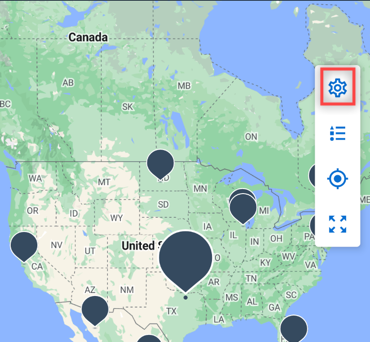

8.  Change the map type to **Hybrid** and turn **Clustering** on.

    <!-- border -->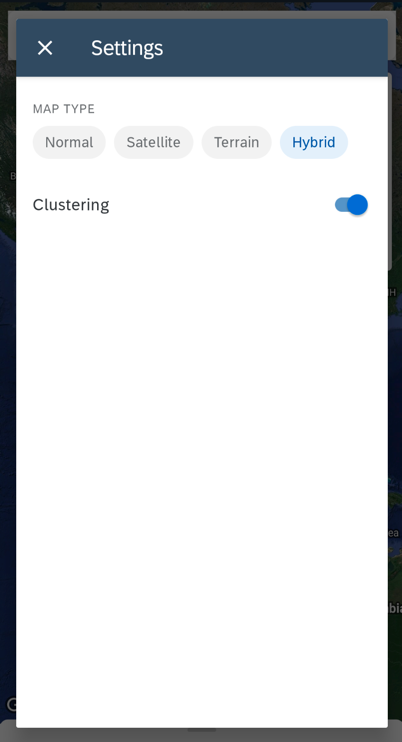

    <!-- border -->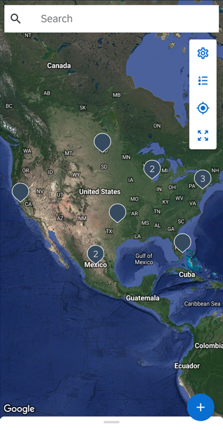

    Notice that the markers in close proximity are now grouped together and a number indicates how many markers are in the cluster.

    <!-- border -->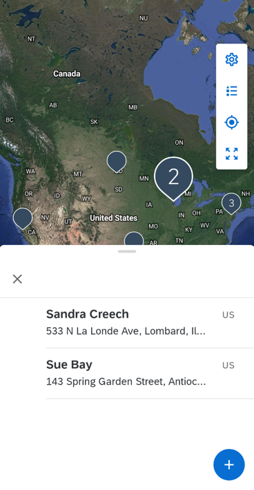

Congratulations! You have now successfully added a Fiori Map to an application and tried out some of the features it provides.


### Enable annotating


In this section, you will test the three different types of annotations.

1.  On Windows, press **`Ctrl+N`**, or, on a Mac, press **`command+O`**, and type **`CustomersFioriMapActivity`** to open `CustomersFioriMapActivity.kt`.

2.  On Windows, press **`Ctrl+F12`**, or, on a Mac, press **`command+F12`**, and type **`onCreate`** to navigate to the `onCreate` method.

3.  Add the following code after the `mGoogleFioriMapView.onCreate` is called. This will save any points, `polylines`, or polygons drawn on the map.

    ```Kotlin
    // Handle the editor's save event.
    // This is where you can implement functions to save the new annotated points, polylines, and polygons
    mGoogleFioriMapView.editorView.setOnSaveListener{annotation ->
        var message: String? = null
        when (annotation) {
            is PointAnnotation -> {
                message = "This is a point"
            }
            is PolylineAnnotation -> {
                message = "This is a polyline with " + annotation.points.size + " points"
            }
            is PolygonAnnotation -> {
                message = "This is a polygon with " + annotation.points.size + " points"
            }
        }

        // import android.app AlertDialog
        val builder = AlertDialog.Builder(mGoogleFioriMapView.context, com.sap.cloud.mobile.fiori.R.style.FioriAlertDialogStyle)
        builder.setMessage(message)
        builder.setPositiveButton("Save") { _, _ ->
            // Close the editor.
            mGoogleFioriMapView.isEditable = false
            when (annotation) {
                is PointAnnotation -> {
                    mActionProvider.addCircle(
                            FioriCircleOptions.Builder().center(annotation.points[0] as FioriPoint).radius(40.0).strokeColor(resources.getColor(R.color.maps_marker_color_5, null)).fillColor(resources.getColor(R.color.maps_marker_color_6, null)).title("Editor Circle").build())
                }
                is PolylineAnnotation -> {
                    mActionProvider.addPolyline(
                            FioriPolylineOptions.Builder().addAll(annotation.points as Iterable<FioriPoint>).color(resources.getColor(R.color.maps_marker_color_3, null)).strokeWidth(4f).title("Editor Polyline").build())
                }
                is PolygonAnnotation -> {
                    mActionProvider.addPolygon(
                            FioriPolygonOptions.Builder().addAll(annotation.points as Iterable<FioriPoint>).strokeColor(resources.getColor(R.color.maps_marker_color_3, null)).fillColor(resources.getColor(R.color.maps_marker_color_4, null)).strokeWidth(4f).title("Editor Polygon").build())
                }
            }
        }
        builder.setNegativeButton("Cancel") { dialogInterface, _ -> dialogInterface.cancel() }
        val dialog = builder.create()
        dialog.show()
    }
    ```

4.  Run the app.

5.  Change the emulator's location information so that Waterloo, Ontario, is the new default location.

    Click on the three dots on the emulator's toolbar to navigate to the emulator's settings.

    <!-- border -->

6.  Under **Location** > **Single points**, search for **`University of Waterloo`** and select the first instance.

    <!-- border -->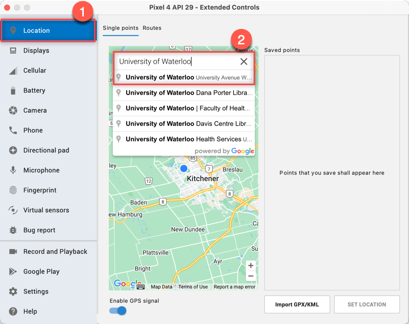

7.  Tap **SAVE POINT**.

    <!-- border -->

8.  Set the name you want to save as.

    <!-- border -->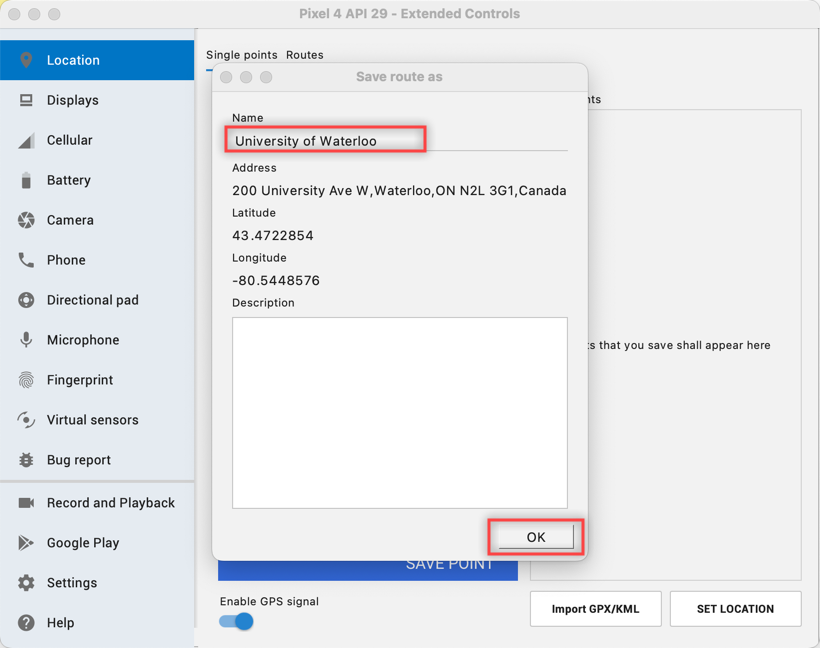

9.  Select the saved point and tap **SET LOCATION** to set the default location.

    <!-- border -->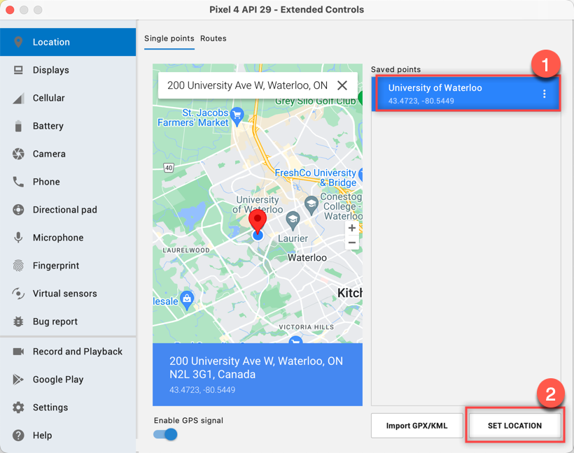

10.  Tap the current location button to zoom into the University of Waterloo and you should see the screen below. (If tapping doesn't work, quit the app, try google **Maps** app first, then restart the app, and try the button again.)

    <!-- border -->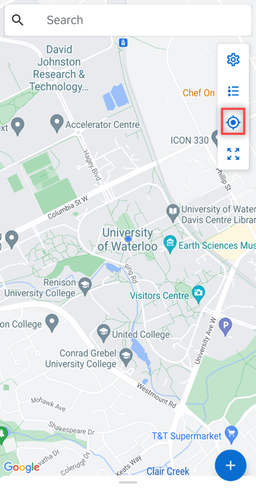

11.  To annotate the map, tap on the floating action button in the corner.

    <!-- border -->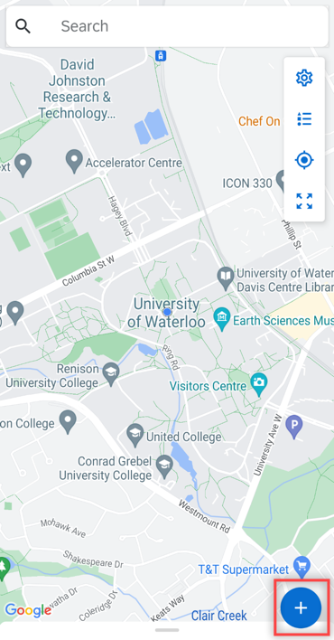

    The bottom panel displays options to annotate the map.

    <!-- border -->

12.  To add the current location as a point:
    -	Tap on the **ADD POINT** option in the panel. Note that it may take a few moments for the emulator to process the new coordinates from before.

        <!-- border -->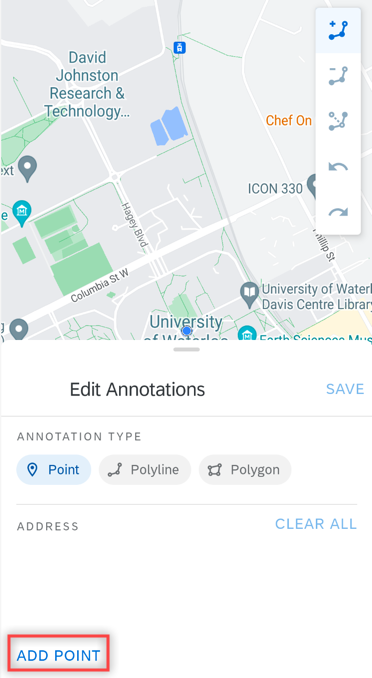

    -	Tap on **Current Location** under the search bar.

        <!-- border -->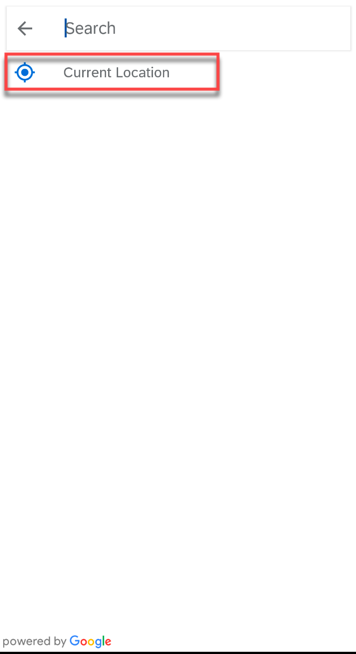

        A list of location options at the University of Waterloo is displayed.

        <!-- border -->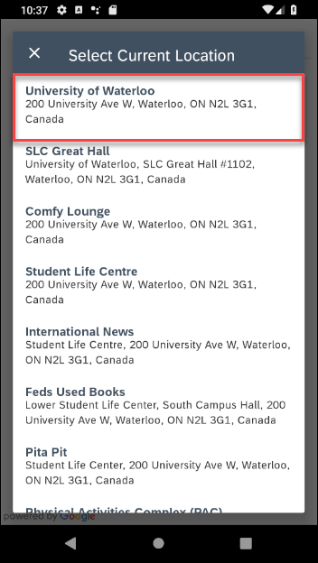

    > If an API error occurs, such as `Failed to get location address com.google.android.gms.common.api.ApiException`, or nothing happens after tapping **Current Location**, ensure that the **Places API** is enabled on the [Google Cloud Platform](https://console.developers.google.com/). Type **`Places API`** in the search bar and you'll be redirected to the following page.
    <!-- border -->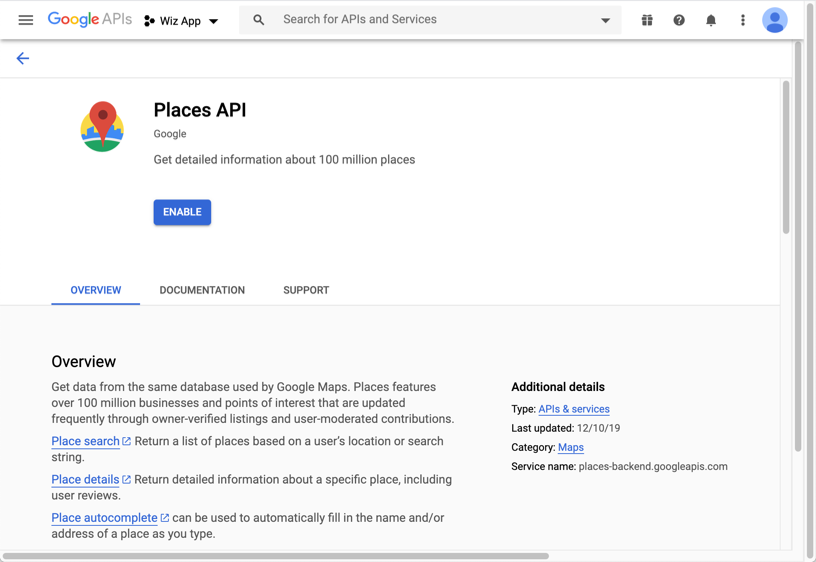

    > If you enabled **Places API** but still nothing happens after tapping, use
    ```URL
    https://maps.googleapis.com/maps/api/place/details/json?place_id=ChIJN1t_tDeuEmsRUsoyG83frY4&fields=name,rating,formatted_phone_number&key=YOUR_API_KEY
    ```
    to see if your application could get certain place details successfully. Note that you'll need to replace the key in this example with your own API key. See [Google Maps Platform](https://developers.google.com/places/web-service/details#PlaceDetailsStatusCodes) for additional information.

    You can also add a point by tapping directly on the map. This will create a white and blue dot indicating where the new point is located. The added point will appear in the panel under the **Address** section. You can only add one point to the map. You can move it by long pressing on it and then dragging it to a new location or you can delete it (select the point and then click the **X** mark in the **ADDRESS** list) and then add a new point.

    <!-- border -->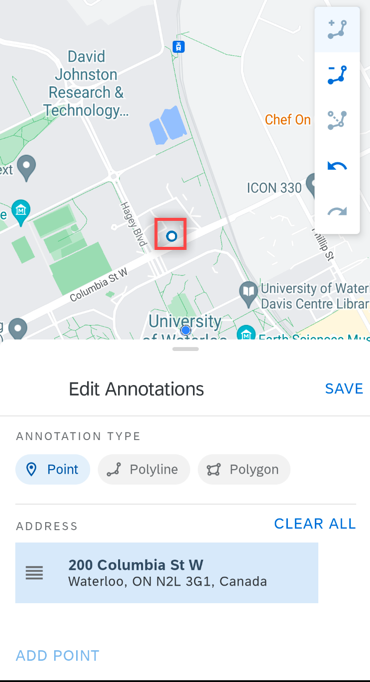

13.  To add a `polyline` to the map, select the **`Polyline`** option and tap different places on the map to add multiple points. The added points will be connected with a line.

    <!-- border -->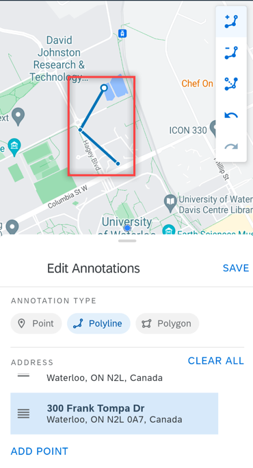

14.  To add a polygon, select the **Polygon** option and tap different places on the map to add multiple points. The points are connected in the order that they appear in the list within the panel and take up the least amount of area.

    <!-- border -->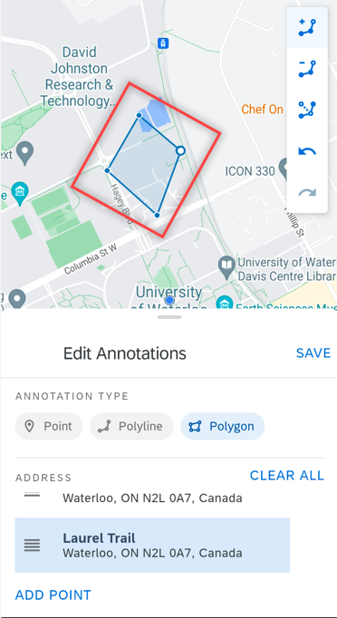

    You can move the existing points on the map by holding onto a point and then dragging it to the desired location.

In order to redraw the points the next time the map is opened, you must save and store them in the app using the on save click listener.


### Customize map markers and legend


In this section you will customize the map markers based on the customer's country. The different marker colors will be recorded in the legend as well.

1.  On Windows, press **`Ctrl+N`**, or, on a Mac, press **`command+O`**, and type **`CustomersFioriMapActivity`** to open `CustomersFioriMapActivity.kt`.

2.  On Windows, press **`Ctrl+F12`**, or, on a Mac, press **`command+F12`**, and type **`addCustomerMarkerToMap`** to navigate to the `addCustomerMarkerToMap` method.

3.  Replace the method with the following code:

    ```Kotlin
    private fun addCustomerMarkerToMap(customer: Customer) {
        val country = customer.country
        val latLng = getCustomerLatLongFromAddress(customer.city + ", " + customer.country)
        latLng?.let {
            var color = (Color.parseColor("#E9573E")) // US
            if (country == "MX") {
                color = (Color.parseColor("#FFA02B"))
            } else if (country == "CA") {
                color = Color.parseColor("#0070F2")
            }
            val customerMarker = FioriMarkerOptions.Builder()
                    .tag(customer)
                    .point(FioriPoint(it.latitude, it.longitude))
                    .title(customer.firstName + " " + customer.lastName)
                    .legendTitle(customer.country)
                    .color(color)
                    .build()
            mActionProvider.addMarker(customerMarker)
            markers[customer.city + ", " + customer.country] = customerMarker
            mGoogleFioriMapView.map?.moveCamera(CameraUpdateFactory.newLatLng(it))
        }
    }
    ```

4.  Run the app.

    The markers now have different colors depending on whether they are located in Canada (CA), the United States (US), or Mexico (MX). The meaning of the colors is shown in the legend.

    <!-- border -->

    With clustering enabled, notice that clustered markers turn white if the markers in the cluster are located in different countries.

Congratulations. You have created an activity that makes use of the Fiori map control.


---
