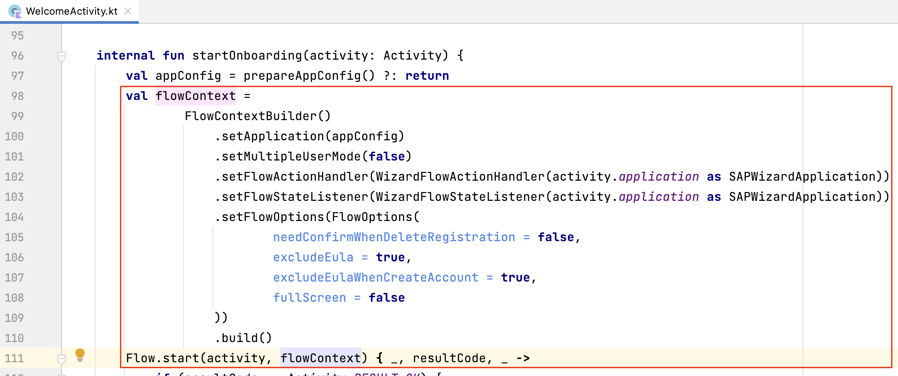
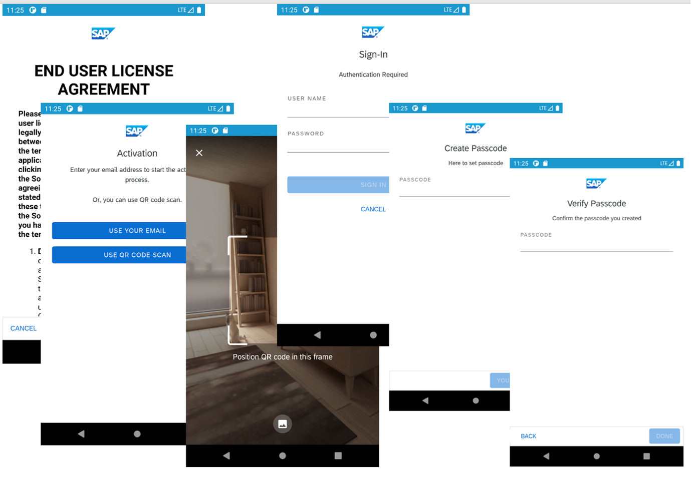

## Prerequisites
- You have [Set Up a BTP Account for Tutorials](group.btp-setup). Follow the instructions to get an account, and then to set up entitlements and service instances for the following BTP services.
    - **SAP Mobile Services**
- You completed [Try Out the SAP BTP SDK Wizard for Android](sdk-android-wizard-app).

## Details
### You will learn
  - How to import the Flows component into the application project
  - How the Flows APIs are used in wizard-generated applications
  - Which screens are provided by the Flows component

The [Flows](https://help.sap.com/doc/f53c64b93e5140918d676b927a3cd65b/Cloud/en-US/docs-en/guides/features/onboarding/android/newflows/Overview.html) component is a new feature of the SAP BTP SDK for Android as of version 3.1 and new features are continually added to the library. The Flows component can reduce and simplify the application code related to the onboarding process, passcode management, and restore and reset scenarios. In addition to providing a default implementation, it also supports options for UI customization and extension points for client code to contribute customized logic. See [Onboarding Using the Flow Component of the SAP SDK for Android](https://blogs.sap.com/2021/02/02/onboarding-using-the-flow-component-of-the-sap-sdk-for-android/) for an overview.

---

[ACCORDION-BEGIN [Step 1: ](Examine the dependencies to the Flows component)]

1.  Open the project you previously created using the SAP BTP SDK Wizard for Android.

2.  Press **`Shift`** twice and type **`build.gradle`** to open the `build.gradle` file of the app module.

3.  Go to the `dependencies` section and find the dependency declaration to the Flows component. **`onboarding`** contains the UI screens and **`flowsv2`** contains the Flows API and logic.

    !

[VALIDATE_1]
[ACCORDION-END]

[ACCORDION-BEGIN [Step 2: ](Explore the usage of the Flows API in a wizard-generated application)]

[OPTION BEGIN [Java]]

1.  Open the project you previously created using the SAP BTP SDK Wizard for Android.

2.  In Android Studio, on Windows, press **`Ctrl+N`**, or, on a Mac, press **`command+O`**, and type **`WelcomeActivity`** to open `WelcomeActivity.java`.

3.  On Windows, press **`Ctrl+F12`**, or, on a Mac, press **`command+F12`**, and type **`startFlow`** to move to the `startFlow` method. To start the onboarding process, firstly create a **`FlowContext`** instance that contains the information required by the flow, such as the application information, the status of multi-user mode, the flow state listener, etc. Then call the `start` method of the `Flow` class to start the onboarding flow, allowing the entire onboarding process to be handled automatically.

    !

    Notice that by default, the type of a flow is **`FlowType.ONBOARDING`**. To start a different type of flow, such as a `Change Passcode` flow, the client code must specify the flow type in the **`FlowContext`** instance. Besides the parameters specified above, there are also many other parameters in the **`FlowContext`** class that can be modified to allow the client code to customize a flow. When the values of the parameters are not specified in the client code, the default values will be used. The details of all parameters in the **`FlowContext`** class will be explained in subsequent tutorials.

4.  **`FlowStateListener`** is a parameter in the **`FlowContext`** class. Using the callbacks defined in the listener, client code can insert logic at certain points during the flow process. For example, after the client policy is retrieved, the client code can retrieve the information that will be used by the app. In Android Studio, on Windows, press **`Ctrl+N`**, or, on a Mac, press **`command+O`**, and type **`WizardFlowStateListener`** to open `WizardFlowStateListener.java`. This class is a sample implementation for the callbacks defined in the **`FlowStateListener`** class. The details of **`FlowState`** and **`FlowStateListener`** will be explained in subsequent tutorials.

[OPTION END]

[OPTION BEGIN [Kotlin]]

1.  Open the project you previously created using the SAP BTP SDK Wizard for Android.

2.  In Android Studio, on Windows, press **`Ctrl+N`**, or, on a Mac, press **`command+O`**, and type **`WelcomeActivity`** to open `WelcomeActivity.kt`.

3.  On Windows, press **`Ctrl+F12`**, or, on a Mac, press **`command+F12`**, and type **`startFlow`** to move to the `startFlow` method. To start the onboarding process, firstly create a **`FlowContext`** instance that contains the information required by the flow, such as the application information, the status of multi-user mode, the flow state listener, etc. Then call the `start` method of the `Flow` class to start the onboarding flow, allowing the entire onboarding process to be handled automatically.

    !

    Notice that by default, the type of a flow is **`FlowType.ONBOARDING`**. To start a different type of flow, such as a `Change Passcode` flow, the client code must specify the flow type in the **`FlowContext`** instance. Besides the parameters specified above, there are also many other parameters in the **`FlowContext`** class that can be modified to allow the client code to customize a flow. When the values of the parameters are not specified in the client code, the default values will be used. The details of all parameters in the **`FlowContext`** class will be explained in subsequent tutorials.

4.  **`FlowStateListener`** is a parameter in the **`FlowContext`** class. Using the callbacks defined in the listener, client code can insert logic at certain points during the flow process. For example, after the client policy is retrieved, the client code can retrieve the information that will be used by the app. In Android Studio, on Windows, press **`Ctrl+N`**, or, on a Mac, press **`command+O`**, and type **`WizardFlowStateListener`** to open `WizardFlowStateListener.kt`. This class is a sample implementation for the callbacks defined in the **`FlowStateListener`** class. The details of **`FlowState`** and **`FlowStateListener`** will be explained in subsequent tutorials.
[OPTION END]

[DONE]
[ACCORDION-END]

[ACCORDION-BEGIN [Step 3: ](Display the UI screens of the Flows component in a wizard-generated application)]

1.  The Flows component provides the required UI screens for the onboarding process and passcode management, including the end user license agreement (EULA) screen for the user to understand and agree to the terms of using the app, the  QR scan screen to get the application configuration, the sign-in screen for user authentication, and passcode screens for the user to create and confirm their passcode.

2.  There are different combinations of the screens depending on the different application configuration and user options in the **`FlowContext`** instance. The following sequence of screens demonstrate the onboarding process of the project previously generated by the wizard. The details for how to customize the screens and include or exclude a screen in a flow will be explained in subsequent tutorials.

    

Congratulations! You now understand the basic concepts of the Flows component and have examined its usage in the project created using the SAP BTP SDK Wizard for Android!

[VALIDATE_2]
[ACCORDION-END]

---
